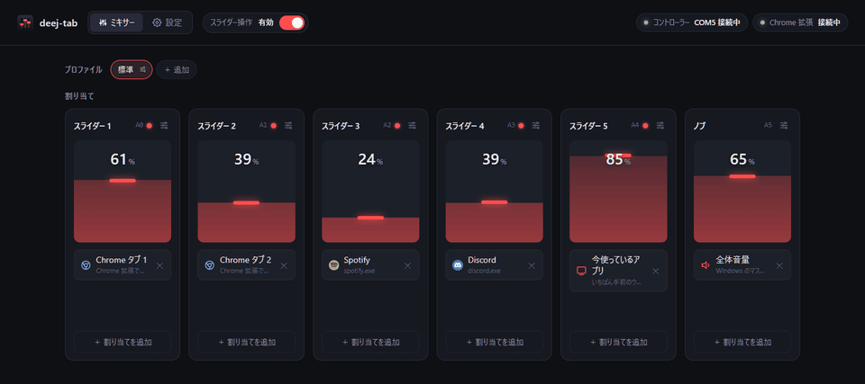
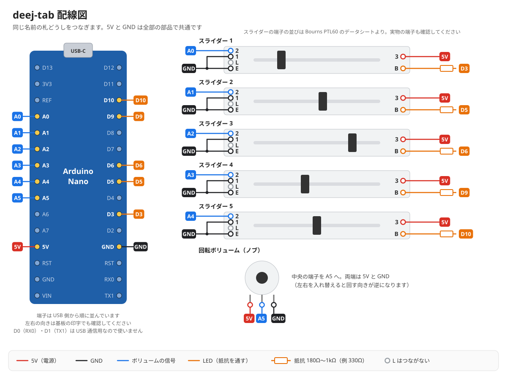
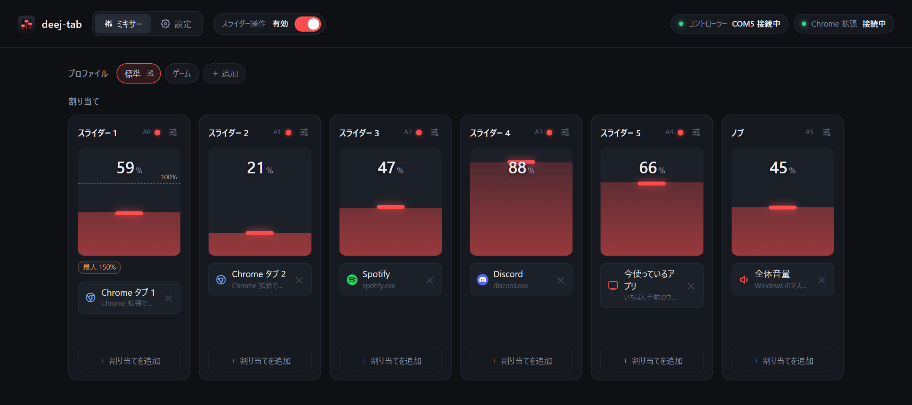
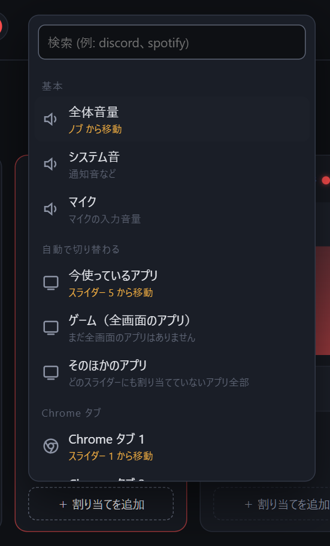
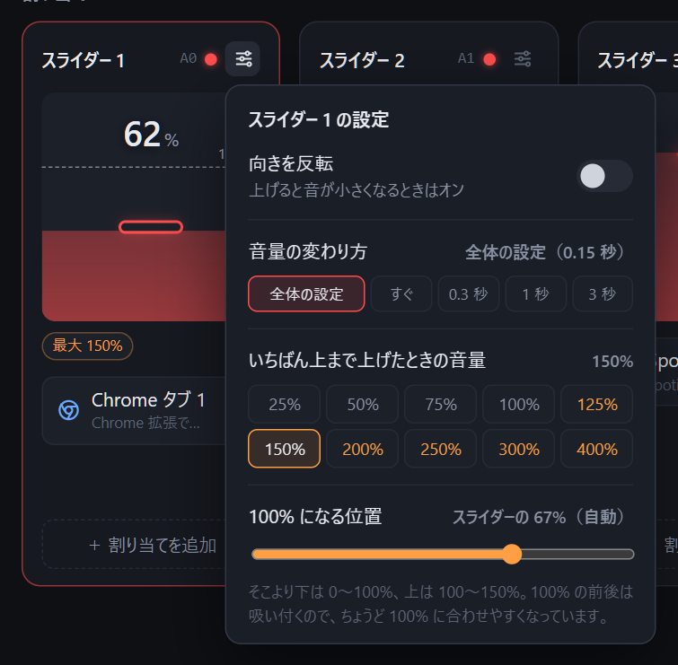
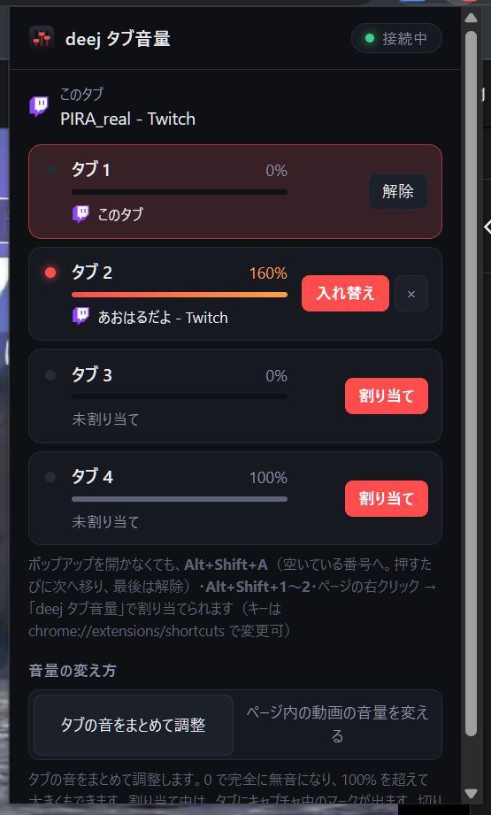
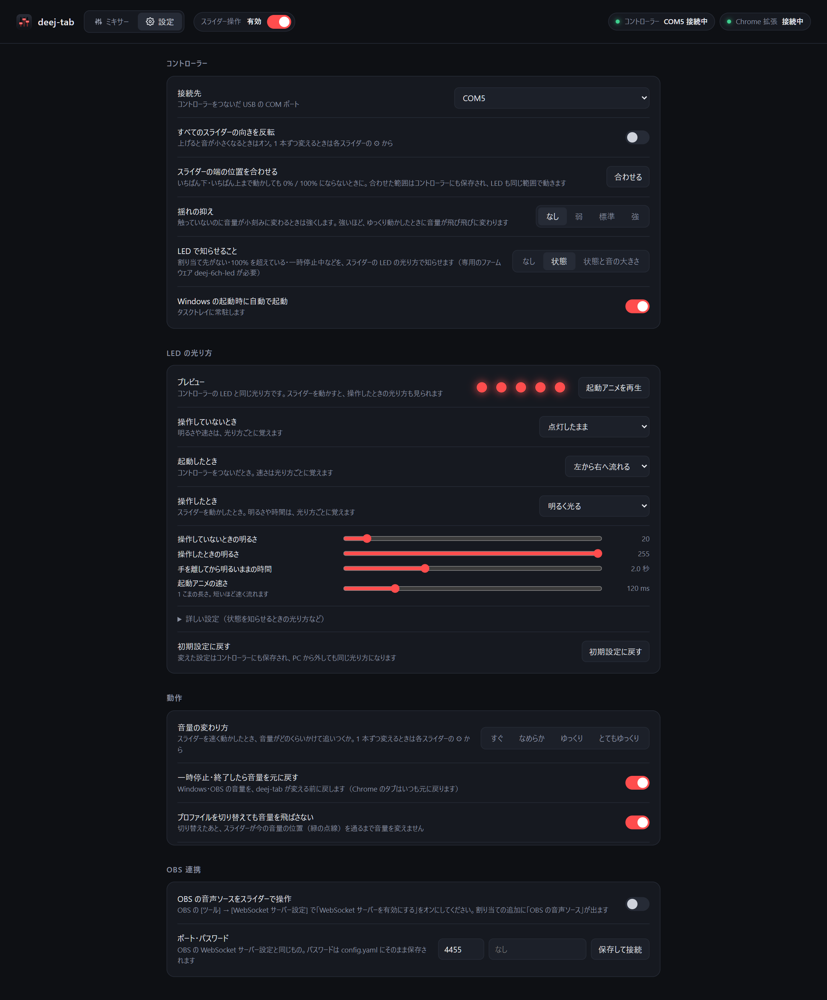
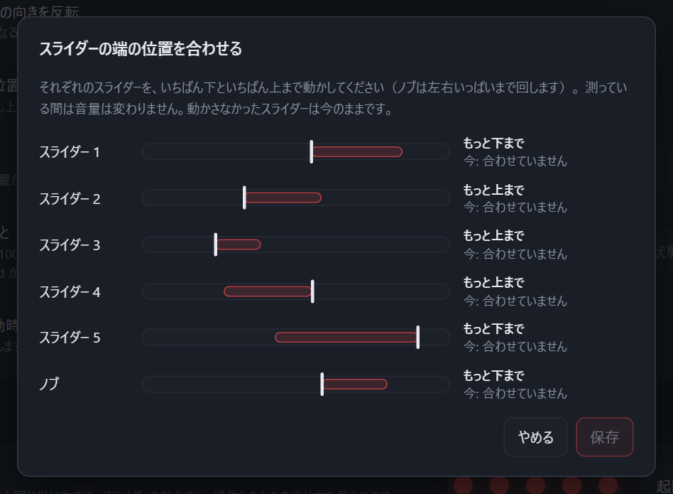

# deej-tab

物理スライダーで、Windows のアプリごとの音量と **Chrome のタブごとの音量** を操作する自作ミキサーです。
[deej](https://github.com/omriharel/deej) を元に、PC アプリ・Chrome 拡張機能・LED 付きファームウェア・3D プリント用ケースまでまとめてあります。

<!-- 実物の写真をここに:  -->



- [できること](#できること) / [必要なもの](#必要なもの) / [セットアップ](#セットアップ) / [使い方](#使い方) / [ソースから動かす](#ソースから動かす) / [仕組み](#仕組み)

## できること

- スライダー 5 本＋ノブ 1 つに、全体音量・マイク・アプリ（Discord・Spotify など）・**Chrome のタブ**・今使っているアプリ・ゲーム・OBS の音声ソースを割り当てる
- Chrome で開いた配信や動画を、タブごとに別のスライダーで調整（Alt+Shift+A でタブを割り当て）
- 日本語・英語の画面（English UI）
- 設定画面で割り当て・スライダーごとの最大音量（100% 超えも可。タブ・OBS のみ）・音量の変わり方を変更
- プロファイル（割り当て一式）の切り替え。アプリが前に来たら自動で切り替えも可
- 一時停止（ショートカットも可）。止めると音量を元に戻す
- スライダーの LED で状態や音の大きさを表示。光り方は設定画面で選べる
- config.yaml は deej と互換

## 必要なもの

### PC

- Windows 10 / 11
- Google Chrome 116 以降（タブの音量を操作する場合）

### 部品

| 部品 | 例 | 数 |
|---|---|---|
| マイコン | Arduino Nano 互換ボード（USB Type-C 版。ケースは Mini-USB の Nano には合いません） | 1 |
| スライダー | Bourns PTL60-15R0-103B2（60mm・10kΩ B カーブ・赤 LED 付き） | 5 |
| 回転ボリューム | 16mm 型 10kΩ B カーブ（SH16K4B103L20KCCI など。6mm ローレット軸 18 山・軸長 20mm・M7 取付ネジ・回り止め付き） | 1 |
| ノブ | 3D プリント（MakerWorld のデータ）または市販の 6mm 軸用（ABS-28 など） | 1 |
| LED 用抵抗 | 180Ω〜1kΩ（1/4W・1/6W など。例：330Ω） | 5 |
| M2 皿ネジ | M2×4 程度（ケースにスライダーを固定。1 本につき 2 本） | 10 |

LED 用抵抗：スライダーの赤色 LED はデータシートで順方向電流 20mA・順方向電圧 1.8V（標準）と規定されているので、5V で 20mA 以下にするには (5V − 1.8V) ÷ 20mA ≒ 160Ω 以上が必要です。値が小さいほど明るくなります（330Ω で約 10mA）。

LED なしのスライダーでも動きます（LED の機能が使えないだけです）。

### 配線



同じ名前の札どうしをつなぎます。5V と GND は全部の部品で共通なので、まとめて Nano の 5V・GND へつなぎます。

| 部品 | 端子 | つなぐ先 |
|---|---|---|
| スライダー 1〜5 | 1 | GND |
| | 3 | 5V |
| | 2（ワイパー） | A0〜A4 |
| | B（LED＋） | 抵抗 → D3 / D5 / D6 / D9 / D10 |
| | E（LED−） | GND |
| | L | つながない |
| 回転ボリューム | 両端 | 5V / GND |
| | 中央 | A5 |

D0 / D1 は USB シリアルに使うので空けておきます。

## セットアップ

[Releases](../../releases) から最新版の zip をダウンロードします。

### 1. ファームウェアを書き込む

1. `deej-tab-firmware-x.y.z.zip` を展開する
2. [Arduino IDE](https://www.arduino.cc/en/software) で `firmware/deej-6ch-led/deej-6ch-led.ino` を開く
3. ボード「Arduino Nano」、ポートを選んで書き込む
   - 互換品で失敗する場合は、プロセッサを「ATmega328P (Old Bootloader)」にする
   - ポートが出ない場合は CH340 のドライバを入れる
   - deej-tab が起動中だと書き込めません（トレイから終了してから）

### 2. PC アプリを入れる

1. `deej-tab-x.y.z-windows.zip` を展開し、好きな場所に置く（設定ファイルとログは exe の隣に作られます）
2. `deej-tab.exe` を起動する
   - 署名していないため「Windows によって PC が保護されました」と出ることがあります。「詳細情報」→「実行」で起動できます
3. タスクトレイのアイコンをクリックすると設定画面が開きます。「設定」→「コントローラー」でマイコンの COM ポートを選びます

### 3. Chrome 拡張機能を入れる

1. `deej-tab-extension-x.y.z.zip` を展開する（展開したフォルダは消さずに残しておく）
2. Chrome で `chrome://extensions` を開き、右上の「デベロッパー モード」をオンにする
3. 「パッケージ化されていない拡張機能を読み込む」で、展開した `deej-tab-extension` フォルダを選ぶ

更新するときは、新しい版でフォルダの中身を置き換えて、`chrome://extensions` の「更新」ボタン（↻）を押します。

### 4. ケースを印刷する（任意）

ケース・ツマミの 3D データは MakerWorld で配布しています。印刷設定と組み立て方もそちらにあります。

**MakerWorld：**（準備中）

寸法を変えたいときは `case/case.py` の先頭の設定を書き換えて作り直せます（下の「ソースから動かす」）。

## 使い方

deej-tab はタスクトレイに常駐します。アイコンをクリックすると設定画面が開きます。右クリックのメニューからは、一時停止・プロファイルの切り替え・自動起動のオン／オフ・終了ができます。
### ミキサー：スライダーに割り当てる



スライダー 1〜5 とノブのそれぞれに、操作したい音量を割り当てます。各スライダーの「＋ 割り当てを追加」から選び、1 本に複数を割り当てることもできます。メーターの塗りが今の音量、赤いつまみがスライダーの位置です。



選べるもの：

| 種類 | 内容 |
|---|---|
| 全体音量・システム音・マイク | Windows の音量 |
| 今使っているアプリ | いちばん手前のウィンドウのアプリ（ゲーム中ならゲーム） |
| ゲーム（全画面のアプリ） | 最後に全画面だったアプリ。ほかのウィンドウが前に来ても操作し続けます |
| そのほかのアプリ | どのスライダーにも割り当てていないアプリ全部 |
| Chrome タブ 1〜6 | 拡張機能で番号を付けたタブ（[下](#chrome-のタブの音量を操作する)） |
| アプリ | 音を出しているアプリ・起動中のアプリ・インストール済みのアプリから選べます。検索もできます |
| OBS の音声ソース | OBS 連携をオンにすると出ます |

同じ割り当て先は 1 本のスライダーにしか置けません（ほかのスライダーにあれば移動します）。

<br clear="right">

### スライダーごとの設定



各スライダーの右上のアイコンから、そのスライダーだけの設定を変えられます。

- **向きを反転**：上げると音が小さくなるときに
- **音量の変わり方**：スライダーを速く動かしたとき、音量がどのくらいかけて追いつくか
- **いちばん上まで上げたときの音量**：25〜400%。100% を超える分は Chrome のタブと OBS だけに効きます（Windows の音量は 100% が上限）
- **100% になる位置**：スライダーのどこで 100% になるか

<br clear="right">

### Chrome のタブの音量を操作する



1. 設定画面で、スライダーに「Chrome タブ 1」などを割り当てます
2. 音量を変えたいタブを開いて、**Alt+Shift+A** を押します。空いている番号に割り当てられ、ツールバーのアイコンに番号が出ます
   - もう一度押すと次の番号へ移り、最後は解除されます
   - **Alt+Shift+1・2** で番号を指定、ページの右クリック →「deej タブ音量」からも割り当て・解除できます（キーは `chrome://extensions/shortcuts` で変更できます）
3. 拡張機能のアイコン（**Alt+Shift+D**）を押すと、割り当ての一覧と今の音量が見られます。ほかのタブに割り当て済みの番号は、ここから入れ替えたり解除したりできます

ポップアップでは、番号ごとの今の音量（100% を超えるとオレンジ）と、割り当てたタブが見られます。

<br clear="right">

タブの音量は「Chrome のアプリ音量 × 全体音量」に対する割合です。音量の変え方は 2 種類あり、ポップアップで切り替えられます。

| 方式 | 内容 |
|---|---|
| タブの音をまとめて調整（初期設定） | タブの音声をキャプチャして音量をかけます。0 でしっかり無音になり、100% を超える音量にもできます |
| ページ内の動画の音量を変える | ページの動画・音声の音量を直接変えます。サイトによっては 0 でもかすかに聞こえます |

### プロファイル

割り当て一式に名前を付けて保存し、切り替えられます（ミキサーの上の「プロファイル」）。プロファイルごとに次のことができます。

- **自動で切り替え**：指定したアプリが前に来たら、そのプロファイルに切り替えます。アプリを終了すると元に戻ります
- **切り替えのショートカット**：キーを押して切り替えます

切り替えた直後は、スライダーが今の音量の位置を通るまで音量を変えません（音量が飛ばないように。設定でオフにできます）。

### 一時停止

設定画面の上の「スライダー操作」スイッチ、タスクトレイのメニュー、ショートカットで一時停止できます。一時停止中はスライダーを動かしても音量が変わりません。止めたときに、Windows と OBS の音量を deej-tab が変える前に戻すこともできます。

### 設定

設定画面の「設定」ページでは、次のものを変えられます。

- **言語**：自動（Windows の表示言語に合わせる）／日本語／English。タスクトレイのメニューと Chrome 拡張機能のポップアップ・右クリックメニューも切り替わります
- **コントローラー**：つなぐ COM ポート、全スライダーの向き、揺れの抑え、LED で知らせること、自動起動
- **LED の光り方**：操作していないとき・起動したとき・操作したときの光り方と明るさ。プレビューで確かめながら選べ、コントローラーに保存されるので PC から外しても同じ光り方になります
- **動作**：音量の変わり方、一時停止したら元に戻す、プロファイル切り替え時に音量を飛ばさない、一時停止のショートカット
- **OBS 連携**：obs-websocket で OBS の音声ソースを操作

<p align="center"></p>

#### スライダーの端の位置を合わせる

いちばん下・いちばん上まで動かしても 0% / 100% にならないときは、「コントローラー」→「スライダーの端の位置を合わせる」で各スライダーを端まで動かします。

<p align="center"></p>

設定は `deej-tab.exe` の隣の `config.yaml` に保存されます。手で書き換えても、保存すると自動で読み直します（形式は deej と互換）。

## ソースから動かす

Python 3 が必要です（3.14 で動作確認）。

```bat
cd app
start.bat
```

初回は `.venv` を作って必要なパッケージを入れ、トレイに常駐します。ログを画面で見たいときは `debug.bat`。

| 作業 | コマンド（`app` フォルダで） |
|---|---|
| テスト | `.venv\Scripts\python -m unittest discover -s tests -v` |
| exe を作る | `.venv\Scripts\python build.py` |
| 配布用 zip を作る | `.venv\Scripts\python ..\tools\release.py --build`（`release/` にできる） |

- ケース：`case` フォルダで `pip install numpy trimesh manifold3d` を入れた venv を作り、`python case.py`。出力は `case/out/`
- 仮スライダー：`tools/fake_sliders.bat` でコントローラーなしに試せます（config.yaml の `com_port` を `socket://127.0.0.1:9000` に）

## 仕組み

```
Nano ──USB シリアル──▶ deej-tab.exe ──Windows の音量 API──▶ アプリの音量
 (スライダーの値)          │  ▲
                          │  └─ 設定画面 (http://127.0.0.1:8765/)
                          └─WebSocket──▶ Chrome 拡張機能 ──▶ タブの音量
```

拡張機能はタブの音声をキャプチャしてゲインをかけます。通信は PC の中（127.0.0.1）だけで、外部には何も送りません。

## ライセンス

MIT License（[LICENSE](LICENSE)）。ファームウェアと config.yaml の形式は [deej](https://github.com/omriharel/deej)（MIT License, © Omri Harel）を元にしています。
